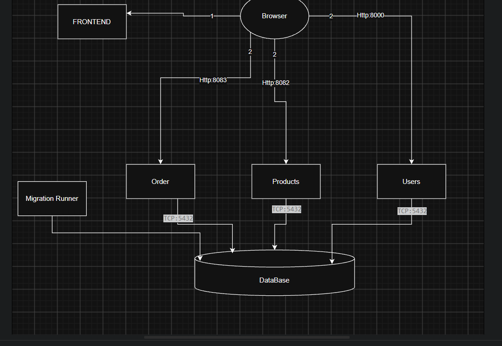

# Module 1 — System Map

## a. Diagram

(Diagram content and layout are mine, drawn by hand before asking Claude anything about it. The image file itself was embedded into the repo by Claude Code from a screenshot I pasted into the chat.)

## b. Request trace

Traced `GET /products`, start to finish:

1. **Frontend issues the request** — [frontend/src/components/products.js:11](../../frontend/src/components/products.js#L11)
   calls `fetchData(`${apiUrl}/products`)`. `fetchData` itself is just a thin
   wrapper around the browser's `fetch()`, at
   [frontend/src/api/api.js:8](../../frontend/src/api/api.js#L8). `apiUrl`
   comes from `config.productsApiUrl` in
   [frontend/src/main.js:8](../../frontend/src/main.js#L8), which reads
   `VITE_PRODUCTS_API_URL` — an env var Docker Compose injects as
   `http://localhost:8082` (see `docker-compose.yml`, the `frontend` service's
   `environment:` block). This confirms the diagram above: it's the browser
   itself making this call, not the frontend container.

2. **URL and receiving service** — `http://localhost:8082/products`. Host
   port `8082` is mapped to the `products-service` container's port `80`
   (`docker-compose.yml`, `products-service.ports`).

3. **Route match** — [products-service/public/index.php:26](../../products-service/public/index.php#L26):
   `$app->get('/products', function (...) {...})`. This is Slim's router
   matching the path directly in `index.php` — there's no separate
   controller class, the route closure *is* the handler.

4. **Query / table** — same closure,
   [products-service/public/index.php:41](../../products-service/public/index.php#L41):
   `$stmt = $pdo->query("SELECT * FROM \"Product\"");`. Raw PDO, no ORM. It
   connects using `DB_HOST=database` (line 27), which is the Postgres
   container's Compose service name, resolved by Docker's internal DNS — this
   only works from inside the Docker network, which is why the frontend has
   to use `localhost:8082` instead of `products-service`.

5. **Response → DOM** — back in
   [frontend/src/components/products.js:18-29](../../frontend/src/components/products.js#L18-L29):
   the JSON array returned by the endpoint is mapped into an array of card
   `
`s and written into `#products-container` via `container.innerHTML`.

**Note:** `users-service` and `orders-service` follow the same shape
(browser → HTTP → route → DB → JSON → DOM) but differ in two ways worth
remembering for the exam:
- `orders-service` never writes SQL by hand — `OrderController.java:19`
  (`@GetMapping("/orders")`) calls `orderRepository.findAll()`, and Spring
  Data JPA generates the query from `OrderRepository` extending
  `JpaRepository<Order, Integer>`.
- `users-service` explicitly lists columns in its `SELECT`
  (`main.py:39`, `USER_COLUMNS`) instead of `SELECT *`, specifically to keep
  the `password` column out of the API response.

## c. Environment gotchas

The first `docker compose up --build` finished in ~3 min. A plain `docker compose up`
(no rebuild) finished in ~35 sec. No errors were thrown and all containers came up
healthy.

**Expected:** Vite's dev server should hot-reload the page when I save a file
in `frontend/src/`. The browser keeps a WebSocket open to
`ws://localhost:5173/?token=…` for exactly this.

**What happened:** I changed the text "Frontend is running successfully!" in
`frontend/src/main.js` and saved. The page didn't update, and the WebSocket's
Messages tab showed only the initial `connected` message. Pressing F5 didn't
help either: the old text stayed.

**How I narrowed it down:**
1. `docker compose exec frontend grep -n "running" src/main.js` showed the
   **new** text, so the bind mount (`./frontend:/app`) was syncing the file
   into the container correctly.
2. In the Network tab, `main.js` came back with status **304 Not Modified**,
   and the Response still contained the **old** text. So it was not the
   browser's cache: the browser asked whether the file had changed, and Vite
   answered "no".
3. No update message ever arrived on the WebSocket.

Conclusion: the file changed on disk, but Vite never received a file-change
notification, so it kept serving its cached, already-processed copy.

## d. Documentation drift

`ARCHITECTURE.md` overstates what two of the three services actually do:

- Line 47: *"Products Service ... Role: Manages product catalog (**CRUD
  operations**)"*
- Line 52: *"Users Service ... Role: Handles user **registration and
  authentication**"*

What's actually true: each service has exactly one route, and it's a
read-only `GET`.

- `products-service/public/index.php` defines `GET /` and `GET /products`
  only — no `POST`, `PUT`, `DELETE` or `PATCH` handler anywhere in the file.
- `users-service/main.py` defines `GET /users` only — no `/register`,
  `/login`, or any auth middleware. There's no password hashing or session
  handling in the codebase at all (the seed data even stores the literal
  string `"hashed_password_here"` as the password).

I grepped both services (and `orders-service`) for `post|put|delete|patch|
register|login|auth` to confirm — the only hits are CORS headers
(`Access-Control-Allow-Methods: ... POST, PUT, DELETE, PATCH ...`) and code
comments, not actual routes.

This matches `docs/modules/module-01.md` itself, which says plainly that
"each service exposes one read-only endpoint" and "nothing creates, edits or
deletes data yet" — so `ARCHITECTURE.md` is describing planned/future
functionality as if it already exists, which is a pretty normal way for a
starter repo's architecture doc to drift ahead of (or behind) the code.
